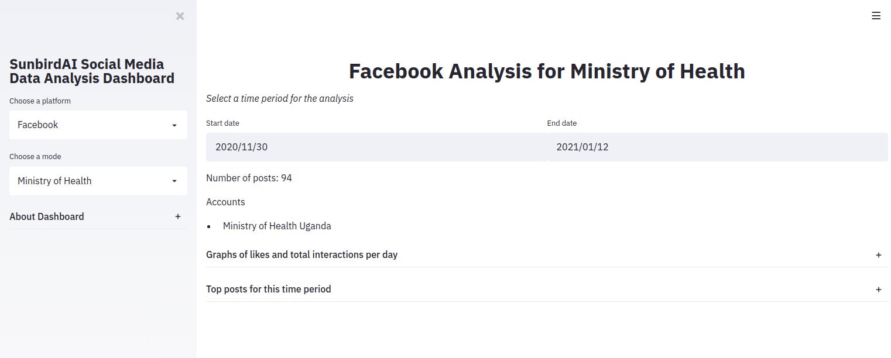

# Social Media Data Dashboard
A dynamic dashboard for fetching public social media data and displaying related stats

## Usage
The dashboard user interface looks like this:

### Usage tips:
The dashboard is divided into two main parts: the `sidebar` on the left and the `main dashboard area` on the right.
* Use the `sidebar` on the left to choose a platform and mode using the `Choose a platform` and `Choose a mode` dropdowns provided there.
 **Definitions:**
    * `Platform`: The social media platform to get data from (Facebook or Twitter)
    * `Mode`: The account from which to get this data
* On the `main dashboard area`:
    * Use the `Start date` and `End date` input fields to choose the date range for which to fetch and view posts. The number of posts fetched and accounts from which they are fetched will be displayed.
    * Use the dropdowns to view statistics and graphs for the given date range.

## About the dashboard
This dashboard is built in Python using the following tools and resources:
* [Streamlit](https://www.streamlit.io/)
* [CrowdTangle API](https://github.com/CrowdTangle/API)
* [Twitter API](https://developer.twitter.com/)

## Project set up
* Clone the project: `git clone https://github.com/SunbirdAI/social-media-data-dashboard.git`
* Create a virtual environment: `python3 -m virtualenv venv`
* Activate the virtual environment: `source venv/bin/activate`
* Install project dependencies: `pip install -r requirements.txt`
* Create an environment file (`.env`) and add environment variables as shown in the `.env.example` file (more detail on the environment variables below)
* Run the project: `streamlit run dashboard.py`

### Environment variables
The environment variables added to the `.env` file are used to determine which account you will be fetching data from and which API key you will be using to fetch this data.

#### Facebook (CrowdTangle) environment variables
Data from Facebook is fetched through the CrowdTangle API. Below are the environment variables used:

Variable | How it is used
------------ | -------------
CROWDTANGLE_API_TOKEN | The API token from CrowdTangle that allows you to fetch data from their API
CROWDTANGLE_*MODE*_LIST_ID | The id of the CrowdTangle list from which the posts will be fetched. Insert your mode to the *MODE* section, based on the definition of `Mode` above.
CROWDTANGLE_POSTS_URL | The url for fetching posts. It is currently `https://api.crowdtangle.com/posts`
DATABASE_URL | The url to a PostgreSQL database for storing tweets
